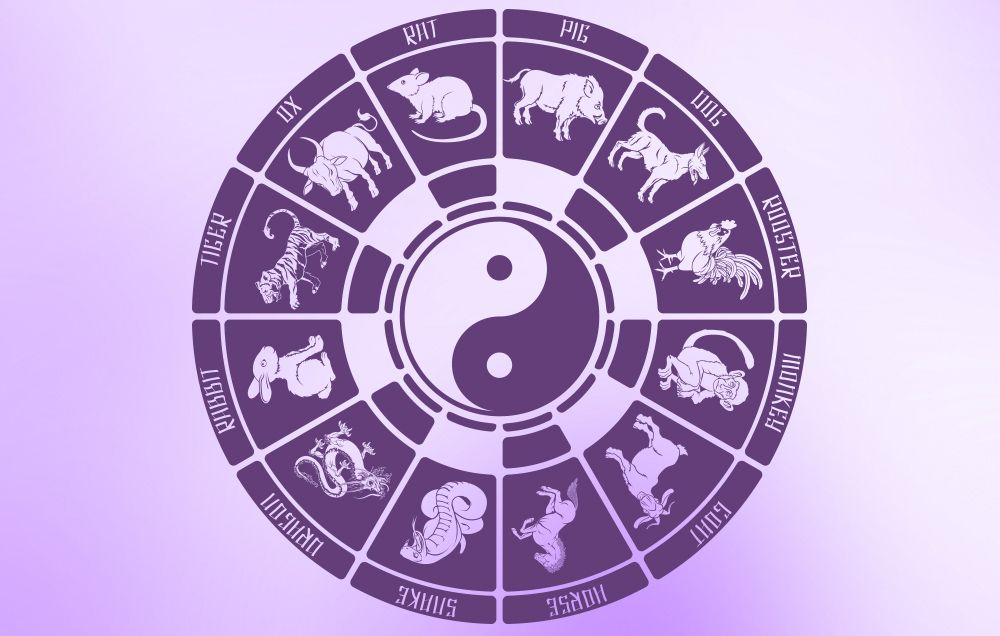

# Get-Lunar-Age



### Find out what is your age in the lunar calendar

Did you know that, in some east asian *(not only)* cultures, the age is not calculated the same way as we do in western countries?

This very simple npm library will let you know how old you are in these countries.

## Instructions

**Install**

```
    npm i get-lunar-age
```

**Use it in your project**

```js
const { getLunarAge } = require("./getLunarAge");
console.log(getLunarAge(1995, 12, 31));
```

**What you will get:**

```
Your lunar age is 28 years old 🌖
```

<sub>Develped by Gaetan Karst</sub>